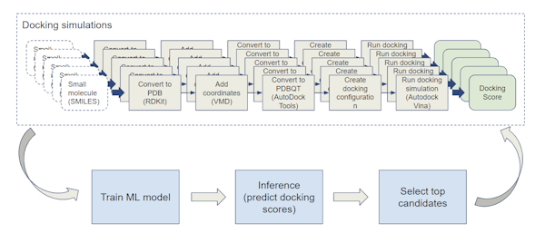

# Protein docking with Parsl

This repository contains the scripts, data and figures used at the Tapia 2023 tutorial on Parsl ([tutorial available here](tutorial/ParslDock.ipynb)).

Protein docking aims to predict the orientation and position of two molecules, where one molecule is a protein, and the other is a protein or a smaller molecule (ligand). Docking is commonly used in structure-based drug design, as it can predict the strength of docking between target small molecule ligands (drugs) to target binding site (receptors). Protein docking played an important role in the race to identify COVID-19 therapeutics.

Docking can be computed using various simulation packages (here we use [AutoDock](https://vina.scripps.edu/)); however, these simulations can be computationally expensive and the search space of potential molecules is enormous. Therefore, given finite compute capacity, we want to carefully choose which molecules to explore. For this purpose we use machine learning to predict molecules with strong docking scores based on on previous computations (a process often called active learning). The resulting ML-in-the-loop workflow proceeds as follows.

)

We use Parsl to implement and execute the docking process in parallel. Parsl allows us to establish dependencies in the workflow and to execute the workflow on arbitrary computing infrastructure, from laptops to supercomputers. We show how Parsl's integration with Python's native concurrency library (i.e., concurrent.futures) let you write applications that dynamically respond to the completion of asynchronous tasks.

## Dependencies

While the parsl code is entirely written in Python, this workflow makes use of non-python code for the simulation steps. These include:
- autodock-vina
- mgltools
- vmd

## Installation
There are two ways to install the code and its dependencies: conda and docker.

### Conda
We provide a Conda environment file to facilitate installation which can be found in `docker/environment.yaml`. To install with conda, in the repository folder, run:
```
conda env create --file docker/environment.yml
```

### Docker
To install with Docker, run the following command within the repository:
```
docker build -t parsldock -f docker/Dockerfile .
```

## Execution

Once installed, the parsldock workflow should be available to run within the Conda environment or docker container using the following command:

```
parsldock
```

Furthermore, the Docker environment is preconfigured to run the workflow on execution:

```
docker run --rm -it parsldock
```

Sample output:
```
parsl-docking-tutorial# parsldock
Computation for C[C@H]([C@@H](c1cc(ccc1OC)OC)O)[NH3+] succeeded: -5.556
Computation for C[C@H](CCC[NH3+])Nc1cc(cc2c1nccc2)OC succeeded: -3.973
Computation for CCCC[N@H+]1CCCC[C@@H]1C(=O)Nc2c(cccc2C)C succeeded: -4.668
Computation for CC[N+](C)(CC)CCOC(=O)C1c2ccccc2Oc3c1cccc3 succeeded: 5.868
Computation for Cc1c(cccc1O)C(=O)N[C@@H](CSc2ccccc2)[C@@H](C[N@H+]3C[C@H]4CCCC[C@H]4C[C@H]3C(=O)NC(C)(C)C)O succeeded: -4.882
Computation for c1cc(oc1/C=N/N2CCOC2=O)[N+](=O)[O-] succeeded: -3.88
Computation for C[NH2+]C[C@@H](c1ccc(c(c1)O)O)O succeeded: -5.37
Computation for C[NH+](C)CCCN1c2ccccc2CCc3c1cccc3 succeeded: -5.734
Computation for COc1cc(ccc1Nc2c3ccccc3nc4c2cccc4)NS(=O)(=O)C succeeded: 5.395
Computation for C[N@H+]1CCC[C@@H]1Cc2c[nH]c3c2cc(cc3)CCS(=O)(=O)c4ccccc4 succeeded: -5.965

Starting batch 0
Computation for C[C@H]([C@H](c1cc(ccc1OC)OC)O)[NH3+] succeeded: 39.95
Computation for C[C@H]([C@@H](c1cc(ccc1OC)OC)O)[NH3+] succeeded: -1.883
Computation for C[C@@H]([C@H](c1cc(ccc1OC)OC)O)[NH3+] succeeded: -6.476
Computation for C[C@@H]([C@@H](c1cc(ccc1OC)OC)O)[NH3+] succeeded: -4.28

Starting batch 1
Computation for C[N@H+]1CC[C@]23c4c5ccc(c4O[C@H]2C(=O)CC[C@H]3[C@H]1C5)O succeeded: -4.616
Computation for C[N@@H+]1CC[C@]23c4c5ccc(c4O[C@H]2C(=O)CC[C@H]3[C@H]1C5)O succeeded: 1.319
Computation for Cc1c(cccc1O)C(=O)N[C@@H](CSc2ccccc2)[C@@H](C[N@@H+]3C[C@H]4CCCC[C@H]4C[C@H]3C(=O)NC(C)(C)C)O succeeded: -5.171
Computation for Cc1c(cccc1O)C(=O)N[C@@H](CSc2ccccc2)[C@@H](C[N@H+]3C[C@H]4CCCC[C@H]4C[C@H]3C(=O)NC(C)(C)C)O succeeded: -0.3204

Starting batch 2
Computation for CC(C)(Cc1ccccc1)[NH3+] succeeded: -4.323
Computation for C([C@@H]([C@@H]1C(=C(C(=O)O1)O)[O-])O)O succeeded: -3.839
Computation for C[NH2+]CCCC1c2ccccc2C=Cc3c1cccc3 succeeded: -4.918
Computation for CCCCCCCCCCCCOS(=O)(=O)[O-] succeeded: -3.649
```

## Testing

Unit, integration and system test cases are provided for your convenience. To run the test cases, simply run the following command from within the environment:

```
tox -- -x
```
